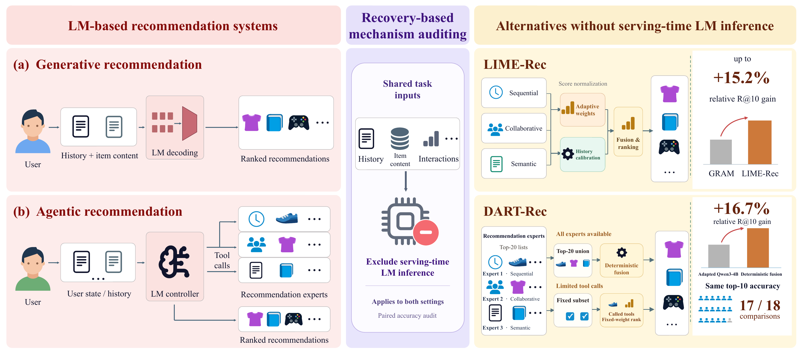

# Is Serving-Time Language-Model Inference Necessary for Recommendation? Evidence from Generative and Agentic Settings

Code for recovery-based mechanism auditing in recommendation.

Repository: [Double-wk/LIME-Rec](https://github.com/Double-wk/LIME-Rec).
**LIME-Rec** replaces serving-time autoregressive LM decoding with sequential,
collaborative, and offline semantic evidence. **DART-Rec** replaces LM-based tool
control with deterministic fusion or fixed expert selection.

## Overview



## Quick start

Run the following from this `code/` directory in a Bash shell. Python 3.10+ is required;
the experiment commands below use CUDA.

```bash
python3 -m venv .venv
source .venv/bin/activate
python -m pip install -e ".[test]"
python -m pytest -q

python -m scripts.data.download_gram_data beauty toys sports
mkdir -p output_final/models
for DOMAIN in beauty toys sports; do
  python -m scripts.training.build_itemcf \
    --config "configs/amazon_${DOMAIN}.json" --top-k 100 --window-size 20 \
    --out "output_final/models/amazon_${DOMAIN}_itemcf.json"
  python -m scripts.training.build_item_embeddings \
    --config "configs/amazon_${DOMAIN}.json" \
    --model BAAI/bge-base-en-v1.5 --device cuda \
    --out "output_final/models/amazon_${DOMAIN}_bge_base.npz"
done
```

For the controlled generative audit, install GRAM in a separate environment using
its upstream instructions, then set `GRAM_PYTHON` to that environment's Python:

```bash
git clone https://github.com/skleee/GRAM.git external/GRAM
export GRAM_PYTHON=/path/to/gram/environment/bin/python

# First check: LIME-Rec matched-20 runs and GRAM Beauty seed 0.
DEVICE=cuda GRAM_DATASETS="beauty" GRAM_SEEDS="0" \
  bash workflows/run_controlled_gram.sh

# After alignment, import, and evaluation pass, run all domains and seeds.
DEVICE=cuda GRAM_DATASETS="beauty toys sports" GRAM_SEEDS="0 1 2" \
  bash workflows/run_controlled_gram.sh
python -m scripts.evaluation.recovery_audit_gram \
  --predictions-dir output_final/results/controlled_gram/predictions \
  --n-resamples 10000 --seed 2027 \
  --out-json output_final/results/controlled_gram/recovery_audit_gram.json
```

After these experts are available, start the limited-tool pipeline smoke check:

```bash
bash scripts/agentic/smoke_budgeted.sh
```

This smoke check evaluates deterministic baselines without calling an LM.
Full controller training and serving commands are in
[the limited-tool guide](scripts/agentic/BUDGETED_TOOLS.md); upstream baseline
compatibility instructions are in [the patch guide](patches/README.md).
The working directory is this `code/` directory; the original `plan.md` mentioned
in the guide is not bundled.

## Main results and conclusions

The paper reports the following results:

| Setting | Main finding |
|---|---|
| Generative recommendation | Eight target–dataset comparisons show seed-wise superiority; GRAM–Sports passes a **5% plug-in relative-loss sensitivity** check. Up to **15.2%** relative R@10 gain over GRAM. |
| All expert outputs available | On 1,000 Beauty users, deterministic fusion reaches R@10 **0.112**, versus **0.096** for imitation-adapted Qwen3-4B (**16.7%** relative gain). |
| At most two tool calls | Fixed expert selection has identical per-user Hit@10 outcomes in **17 of 18** dataset–seed–controller comparisons; this is empirical agreement, not a non-inferiority certificate. |

The results show that the tested recommendation accuracy can often be recovered
without the audited serving-time LM mechanism. Offline pretrained semantic
representations remain in use. Recovery is not universal: Yelp and some long-history
Sports regimes fail the reported recovery criteria. Failed recovery leaves inference
necessity unresolved; top-10 accuracy also does not establish conversational quality,
explanations, diversity, or long-horizon utility.

See [the supplementary PDF](../附件/supplementary.pdf) for protocols and detailed
results. This package contains source code and Figure 1, with no datasets, model
weights, or result files. Running the commands generates new artifacts locally;
no experiments were rerun to prepare the package.

## Citation

Please cite the paper if you use this code or framework. This provisional entry
matches the anonymous manuscript and its year metadata; it does not imply publication.
Replace it with the official bibliographic record when available.

```bibtex
@misc{anonymous2027servingtime,
  author = {{Anonymous Submission}},
  title  = {Is Serving-Time Language-Model Inference Necessary for Recommendation? Evidence from Generative and Agentic Settings},
  year   = {2027},
  note   = {Anonymous manuscript}
}
```
